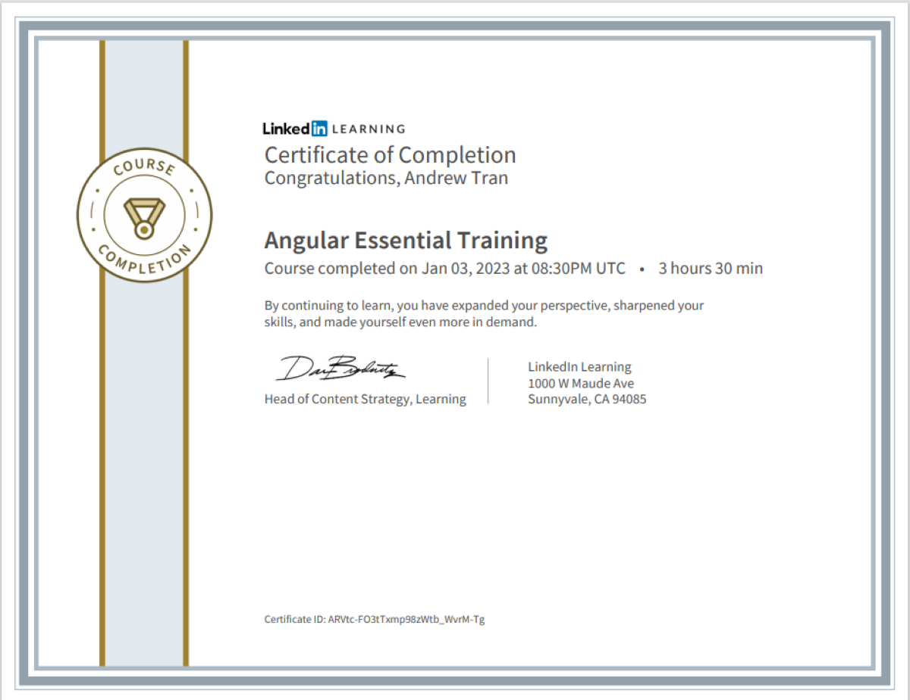

## Angular-Essentials-LinkedIn-Course

-In this following repository, I have attached all of the files that I had used when I was going through the 'Angular-Essential-Training' LinkedIn Course in December 2022 and January 2023. Below, here is my certification showing my completion of the LinkedIn Course: 

  

  

-Link to "Angular Essential Training" LinkedIn Learning Course: [here](https://www.linkedin.com/learning/angular-essential-training-2/why-use-angular?autoplay=true&u=57888345)

-Link to Angular Documentation: [here](https://angular.io/)
